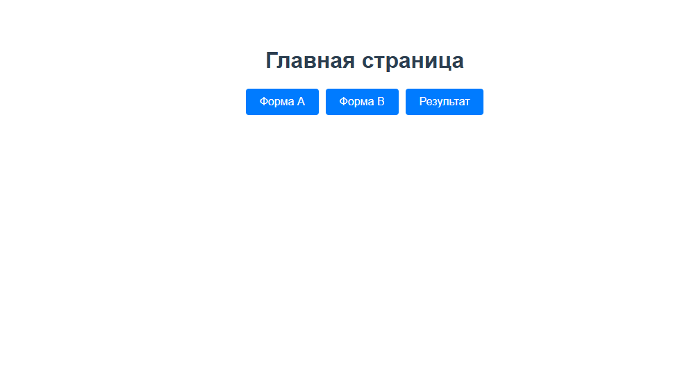
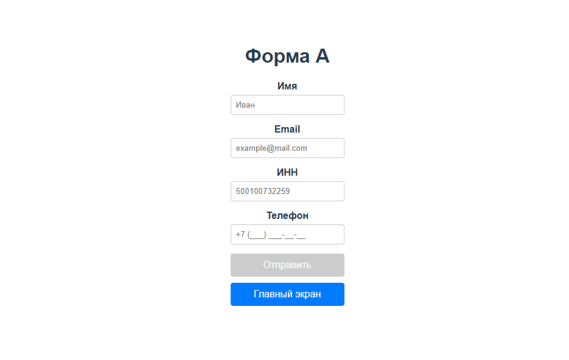
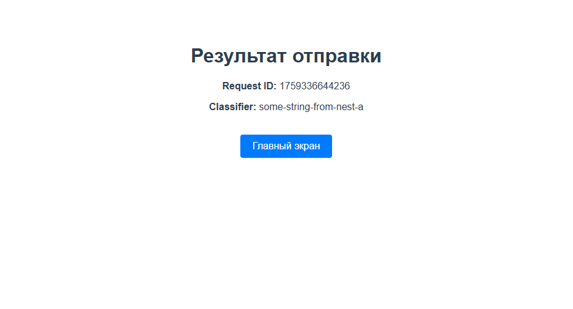
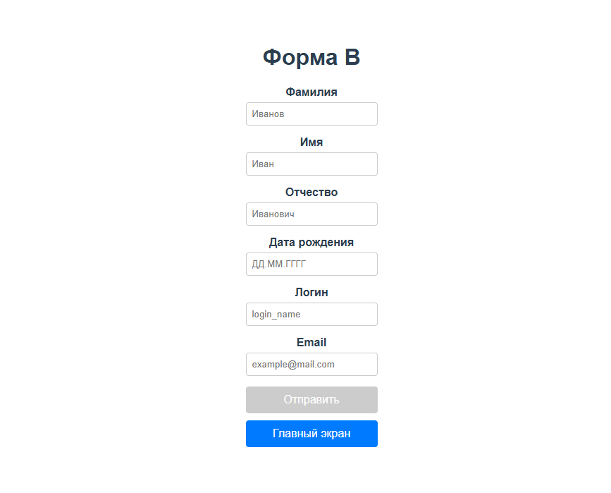
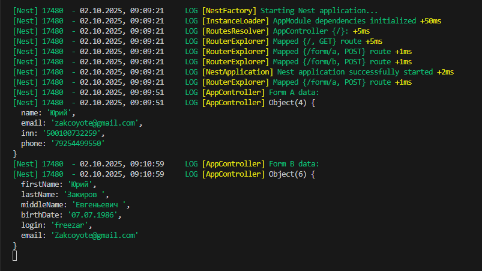

# Проект "Vue 3 + NestJS Forms"

Этот проект представляет собой мини-приложение, разработанное на **Vue 3 + TypeScript + Vite** для фронтенда и **NestJS** для бэкенда. Цель проекта — продемонстрировать создание форм с валидацией в реальном времени, имитацией отправки данных и сохранением результатов, а также интеграцию фронтенда с бэкендом.

## Используемые технологии

| Frontend | State Management | Validation | UI / Components | Backend | Language | API & Tools |
|---|---|---|---|---|---|---|
|     |  |   |    |  |  |    |

## Функциональность проекта

Проект включает в себя две формы (`Форма A` и `Форма B`), каждая со своим набором полей и правилами валидации:

-   **Форма A:**
    -   `Имя` (обязательное)
    -   `Email` (необязательное, валидный формат)
    -   `ИНН` (обязательное, проверка на физ. лицо/юр. лицо с контрольной суммой)
    -   `Телефон` (обязательное, формат `+7 (XXX) XXX-XX-XX`, сохраняется как `7XXXXXXXXXX`)
-   **Форма B:**
    -   `Имя` (обязательное)
    -   `Фамилия` (обязательное)
    -   `Отчество` (обязательное)
    -   `Дата рождения` (обязательное, формат `ДД.ММ.ГГГГ`, проверка на существование даты и возраст 0-120 лет)
    -   `Логин` (обязательное, мин. 6 символов, латиница `[a-zA-Z][a-zA-Z0-9_]*`)
    -   `Email` (обязательное, валидный формат)

**Общие особенности:**
-   **Валидация в реальном времени:** Ошибки отображаются под полями, кнопка "Отправить" активна только при полной валидности формы.
-   **Отправка данных:** Имитация отправки на сервер (или реальный NestJS бэкенд) с отображением статуса загрузки.
-   **Страница результата:** Отображает `requestId` и `classifier` после успешной отправки формы.
-   **Навигация:** Удобная навигация между главной страницей, формами и страницей результата.

## Структура проекта

```
form-kit-vue/
├─ server/             # NestJS бэкенд
│  ├─ src/
│  │  ├─ app.module.ts
│  │  ├─ main.ts
│  │  ├─ forms/
│  │  │  ├─ forms.module.ts
│  │  │  ├─ form-a/
│  │  │  └─ form-b/
│  │  └─ ...
│  ├─ package.json
│  ├─ README.md       # README для бэкенда
│  └─ ...
├─ vue-forms/          # Vue 3 фронтенд
│  ├─ src/
│  │  ├─ app/
│  │  ├─ components/
│  │  ├─ lib/
│  │  ├─ pages/
│  │  ├─ store/
│  │  ├─ styles/
│  │  └─ ...
│  ├─ package.json
│  ├─ README.md       # README для фронтенда
│  ├─ .env            # Переменные окружения (например, VITE_API_BASE_URL)
│  └─ ...
├─ package.json        # Корневой package.json (для общих зависимостей или скриптов, если используется монорепо)
├─ README.md           # Общий README для всего проекта (этот файл)
└─ ...
```

## Установка

Для запуска проекта необходимо установить зависимости для обеих частей:

1.  **Клонируйте репозиторий:**
    ```bash
    git clone git@github.com:Zakirov-Yuriy/form-kit-vue.git
    cd form-kit-vue
    ```
2.  **Удалите все папки `node_modules` и `package-lock.json`** из корневой директории, а также из `server/` и `vue-forms/` (это поможет избежать конфликтов зависимостей):
    ```bash
    # Для Windows PowerShell:
    Remove-Item -Path node_modules -Recurse -Force -ErrorAction SilentlyContinue; Remove-Item -Path package-lock.json -ErrorAction SilentlyContinue
    cd server
    Remove-Item -Path node_modules -Recurse -Force -ErrorAction SilentlyContinue; Remove-Item -Path package-lock.json -ErrorAction SilentlyContinue
    cd ..
    cd vue-forms
    Remove-Item -Path node_modules -Recurse -Force -ErrorAction SilentlyContinue; Remove-Item -Path package-lock.json -ErrorAction SilentlyContinue
    cd ..

    # Для Bash/Git Bash:
    # rm -rf node_modules package-lock.json
    # cd server
    # rm -rf node_modules package-lock.json
    # cd ..
    # cd vue-forms
    # rm -rf node_modules package-lock.json
    # cd ..
    ```
3.  **Установите зависимости для NestJS бэкенда:**
    ```bash
    cd server
    npm install
    npm i @nestjs/swagger
    ```
4.  **Установите зависимости для Vue 3 фронтенда:**
    ```bash
    cd vue-forms
    npm install
    ```

## Запуск

Для полноценной работы приложения необходимо запустить как бэкенд, так и фронтенд.

1.  **Запустите NestJS бэкенд (в отдельном терминале):**
    ```bash
    cd server
    npm run start:dev
    ```
    Сервер будет запущен на `http://localhost:4000`.

2.  **Запустите Vue 3 фронтенд (в другом терминале):**
    ```bash
    cd vue-forms
    npm run dev
    ```
    Фронтенд будет запущен на `http://localhost:5173` (или на другом порту, если 5173 занят).

## Сценарий проверки

1.  Откройте браузер по адресу `http://localhost:5173`.
2.  На главной странице вы увидите стилизованные кнопки для перехода к "Форма A", "Форма B" и "Результат".
    
3.  Перейдите на "Форма A".
    
4.  Попробуйте ввести некорректные данные. Ошибки валидации должны появляться под полями. Кнопка "Отправить" должна быть неактивна.
5.  Введите корректные данные. Кнопка "Отправить" станет активной.
6.  Нажмите "Отправить". Появится индикатор загрузки.
7.  При успешной отправке (80% шанс) вас перенаправит на страницу результата (`/result`), где будут отображены `requestId` и `classifier`, полученные от NestJS бэкенда.
    
8.  При ошибке (20% шанс) на форме появится сообщение об ошибке.
9.  На страницах форм и на странице результата есть кнопка "Главный экран" для возврата на главную страницу.
10. Перейдите на "Форма B".
    

## Логирование на сервере

При отправке данных из форм, NestJS бэкенд логирует полученную информацию в консоль, что подтверждает успешное получение данных.


